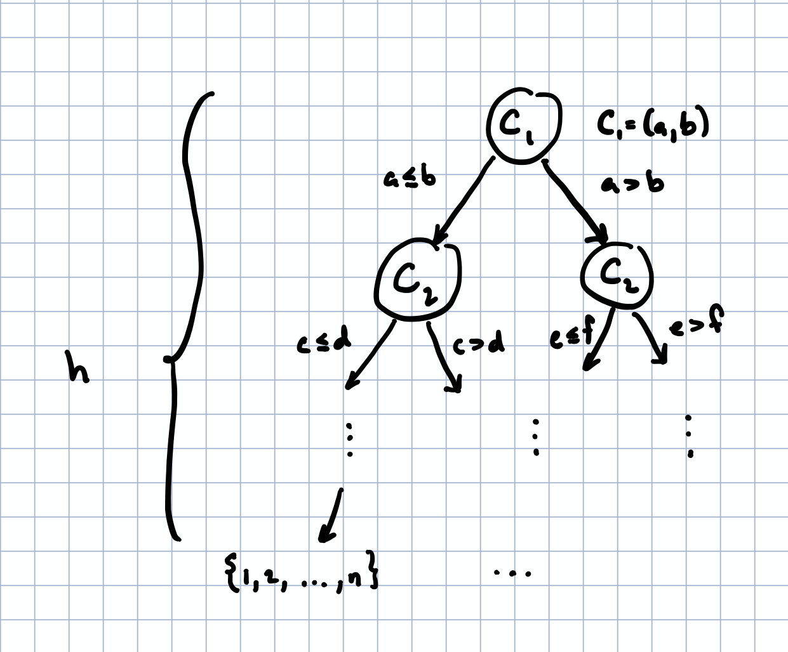

title: Comparisons and information theory: why the worst-case complexity of sorting is n log n
slug: sorting-bounds
category: math
tags: math, information-theory, statistics
date: 2020-06-19

In this post, we'll talk a bit about the usual proofs about the
worst-case query complexity of sorting (at least, in the deterministic case) and then
use a beautiful (and surprisingly simple!) tool from computational lower bounds to give a very general argument about the construction 

## The usual approach
There are many notes and posts talking about the fact that sorting will, in the worst case, always take $\Omega(n \log n)$ comparisons; equivalently,
in the worst case, the number of comparisons is about a constant factor
away from $n \log n$ when $n$ is large. In many cases, the proof
presented depends on the fact that the sorting algorithm is deterministic and goes a little like this (see [here](https://www.bowdoin.edu/~ltoma/teaching/cs231/fall07/Lectures/sortLB.pdf) for a common case):

### Preliminaries

Let $C_k$ be the $k$th step of a deterministic sorting algorithm
(this can be represented, for example, as a tuple containing what the next comparison should be) with input $L \in K^n$ where $L$ is a list of
$n$ comparable elements. (For example, $L$ can be a list of real numbers,
in which case $K = \reals$.)

By the definition of a deterministic algorithm, $C_k$ depends only on the past $k-1$ comparisons; *i.e.*, $C_k(C_{k-1}, C_{k-2}, \dots, C_1)$. (I am slightly overloading
notation here, of course, but the meaning should be clear.) This means that we can view the
behavior of the algorithm as a tree, where $C_k$ is a child node of $C_{k-1}$ which itself is a child node of $C_{k-2}$, etc. Additionally, the tree is
*binary* since the output of a comparison is only one of two possibilities (if $C_k = (a, b)$, then either $a\le b$ or $b \le a$).

Finally, let the leaf nodes of this tree be the list of indices (say, $p$, where each entry is an index, $p_i \in \{1, \dots, n\}$ for $i=1, \dots, n$) such that the list permuted
at these indices is sorted, $L_{p_1} \le L_{p_2} \le \dots, \le L_{p_n}$. Note that the number of nodes needed to get from the root node to a given
leaf node (or permutation) is exactly the number of comparisons that the algorithm makes before it returns a specific permutation. If we
can show that the height (the length of the longest path from root to leaf) of the tree is always larger than about $n \log n$, then we've shown that this algorithm must take at least $n \log n$ steps.

### Bound on the height

The idea for the bound is pretty simple: since this algorithm is a sorting
algorithm and it can receive *any* unsorted list, then each of the $n!$ possible permutations must be a leaf node of the tree. (Why?) Additionally,
the maximum number of leaves for a binary tree of height $h$ is $2^h$, which, in turn, implies that we must have $2^h \ge n!$. Taking the log of both sides shows that:
$$
h = \log(2^h) \ge \log(n!) = \Omega(n\log n),
$$
which is exactly what we wanted to show. (The second equality is shown, for example, in the [original reference for this proof](https://www.bowdoin.edu/~ltoma/teaching/cs231/fall07/Lectures/sortLB.pdf); see page 2.)

### Some takeaways from this proof
To prove this statement we only really used a few things: (a) the algorithm
has to decide between $n!$ things, and (b) at each query, it only receives a "yes" or a "no" (as we will soon make rigorous, it only gains 1 bit of information from each query). The rest of the proof simply sets up scaffolding for the remaining parts, most of which is really somewhat orthogonal to our intuition. The point is: look, we have $n!$ things we have to decide on and every time we ask a question, we cut down our list of possible true answers by about half. How many times do we need to cut down our list to be able to have exactly one possible answer? (Of course, as we showed before, this should be $\log_2(n!)$.)

Now, a good number of writings (and some textbooks) I've seen simply end here by saying "the algorithm gains at most 1 bit for every query and we need at least $\log(n!) \sim n \log n$ bits" and then give some vague citation to Shannon's theorem about communication without explicitly writing out any argument. (While there is some connection, it's unclear what it is or how to even make it rigorous in a general sense.) It's a bit of a shame since it doesn't really take much math to fully justify this intuitive statement, as we will see next.

## An information-theoretic approach
The idea behind a (simple) information theoretic approach is to view the algorithm as attempting to 'uncover' the true, sorted permutation by querying an oracle that knows whether two elements are in sorted order or not. Here, the oracle gets to choose some 'true' permutation uniformly at random and then the sorting algorithm queries the oracle in a restricted sense: it can only ask yes or no questions about the list.

More formally, we will let $\mathcal X$ be the set of all $n!$ possible permutations of $1$ through $n$ and let $X$ the oracle's permutation such that $X \sim \mathcal X$ is uniformly randomly sampled from $\mathcal X$. Then, the algorithm gets to ask a sequence of yes/no queries $Y_i \in \{0, 1\}$ for $i=1, \dots, k$ which are dependent on the permutation $X$, and, at the end of $k$ queries, must respond with some 'guess' for the true permutation $\hat X$, which is a random variable that depends only on $Y$.

We can represent the current set up as a Markov chain $X \to Y \to \hat X$, since $\hat X$ is conditionally independent of $X$ given $Y$ (*i.e.*, the algorithm can only use information given by $Y$) while the random variable $Y$ depends only on $X$. The idea then is to give a bound on the number of queries $k$ required for an algorithm to succeed with probability 1.

To give a lower bound on this quantity, we'll use a tool from information theory called Fano's inequality, which, surprisingly, I don't often see taught in information theory courses. (Perhaps I haven't been taking the right ones!)

### Fano's inequality
I learned about this lovely inequality in John Duchi's class, EE377: *Information Theory and Statistics* (the lectures notes for the class are [here](http://web.stanford.edu/class/stats311/lecture-notes.pdf)). Its proof really makes it clear why entropy, as defined by Shannon, is pretty much the exact right quantity to look at. We'll explore a weaker version of it here that is simpler to prove and requires fewer definitions but which will suffice for our purposes.

We will use $X, Y$ as random variables and set $H$ as the entropy, defined:
$$
H(X) = -\sum_{X \in \mathcal{X}}P(X) \log P(X),
$$
where $\mathcal{X}$ is the space of values that $X$ can take on. The conditional entropy of $X$ given $Y$ is defined as
$$
H(X|Y) = -\sum_{Y \in \mathcal Y} P(Y) \sum_{X \in \mathcal X} P(X\mid Y) \log P(X\mid Y) = H(X, Y) - H(Y).
$$
As usual, the entropy $H$ is a measure of the 'uncertainty' in the variable $X$, with the maximally uncertain distribution being the uniform one.[^entropy] Additionally, note that $H(X, Y)$ is the entropy taken with respect to the joint distribution of $X$ and $Y$.

For this post, we will only make use of the following three properties of the entropy (I will not prove them here, as there are many available proofs of them, including the notes above and Cover's famous *Elements of Information Theory*):

1. The entropy can only decrease when removing variables, $H(X, Y) \ge H(X)$.
2. The entropy is smaller than the log of the size of the sample space $H(X) \le \log|\mathcal X|$. (Equivalently, the uniform distribution on $\mathcal X$ has the highest possible entropy, $\log|\mathcal X|$.)
3. If a random variable $\hat X$ is conditionally independent of $X$ given $Y$ (*i.e.*, if $X \to Y \to \hat X$ is a Markov chain), then $H(X\mid \hat X) \ge H(X\mid Y)$. This is often called a [data processing inequality](https://en.wikipedia.org/wiki/Data_processing_inequality), which simply says that $X$ has smaller entropy knowing $Y$ than knowing a variable, $\hat X$, that has undergone further processing. In other words, you cannot gain more information about $X$ from a variable $Y$ by further processing $Y$.

This is all we need to prove the following inequality. Let $X \to Y \to \hat X$ be a Markov chain such that $\hat X$ is conditionally independent of $X$ given $Y$, then the probability that $X \ne \hat X$ is given by $P_e$ and $P_e$ satisfies
$$
P_e \ge 1 - \frac{k+1}{\log |\mathcal X|},
$$
where $k$ is the number of binary queries made and $|\mathcal X|$ is the number of elements in $\mathcal X$.

### A quick aside
Proving this inequality is enough to show the claim. Note that, we want the probability of error to be 0 (since we want our algorithm to work!) so
$$
1 - \frac{k+1}{\log |\mathcal X|} \le 0 \quad \text{implies} \quad k+1 \ge \log |\mathcal X|,
$$
and, since $|\mathcal X|$ is the space of possible permutations of size $n$, (of which there are $n!$ of) then $|\mathcal X| = n!$ and $\log n! \sim \Omega(n \log n)$ then $k$ must satisfy
$$
k = \Omega(n \log n).
$$
In other words, the number of queries (or comparisons, or whatever) $k$ must be approximately at least as large as $n \log n$, asymptotically (up to constant multiples). In fact, this proves a slightly *stronger* statement that no probabilistic algorithm can succeed with nonvanishing probability if the number of queries is not on the order of $n \log n$, which our original proof above does not cover!

### A proof of Fano's inequality

[^entropy]: In fact, the entropy is really a measure of how close a variable is to the uniform distribution, in the case of compact domains $\mathcal X$—the higher the entropy, the closer it is.